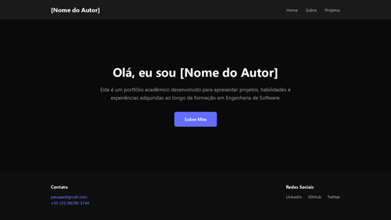
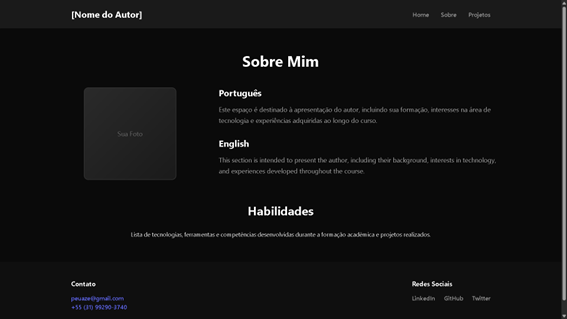
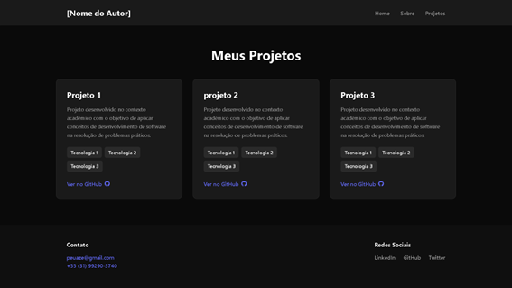

# 🏷️ Portfólio Profissional 

> Projeto acadêmico desenvolvido para a disciplina de **Laboratório de Desenvolvimento de Software**, com o objetivo de criar um portfólio web reutilizável.

---

## 🚧 Status do Projeto


---

## 📚 Índice
- [Wireframe](#-wireframe)
- [Protótipo](#-protótipo)
- [Sobre o Projeto](#sobre-o-projeto)
- [Funcionalidades](#-funcionalidades)
- [Autores](#-autores)
- [Tecnologias Utilizadas](#-tecnologias)
- [Estrutura do Projeto](#-estrutura-do-projeto)
- [Estrutura das Páginas](#-estrutura-das-páginas)
- [Como Executar](#-como-executar)


---

## 🔗 Wireframe

- 🎨 Figma: https://www.figma.com/design/FGR596awWqFuYUBk3jcczj/Portfolio

---

## 📷 Protótipo

- **Home:**  
  

- **Sobre:**  
  

- **Projetos:**  
  
  
---

## 📝 Sobre o Projeto

Aplicação web desenvolvida para apresentar informações profissionais de forma organizada, com navegação entre páginas e estrutura reutilizável para diferentes usuários.

---

## ✨ Funcionalidades

- 🏠 Página inicial com introdução do autor  
- 👤 Página **Sobre Mim** com descrição detalhada (PT/EN)  
- 💻 Exibição de habilidades  
- 📁 Projetos exibidos em formato de cards com descrição e tecnologias utilizadas
- 🔗 Links para repositórios  
- 📩 Área de contato (estrutura inicial)  
- 📄 Header e Footer padronizados  

---

## 👨‍💻 Autores

- Arthur Modesto Couto
- Bernardo Carvalho Denucci Mercado
- Mateus Azevedo Araújo
- Matheus Dias Mendes
  
---

## 🛠 Tecnologias

- HTML, CSS, JavaScript  
- React  
- React Router  
- Vite 

---

## 📁 Estrutura do Projeto

```
projeto/
├── public/                    # Arquivos estáticos públicos
│   └── vite.svg             # Logo do Vite
├── src/                      # Código-fonte principal
│   ├── components/           # Componentes reutilizáveis
│   │   ├── Header.jsx        # Barra de navegação superior
│   │   ├── Header.css        # Estilos do Header
│   │   ├── Footer.jsx        # Rodapé da aplicação
│   │   ├── Footer.css        # Estilos do Footer
│   │   ├── Layout.jsx        # Layout principal (Header + Outlet + Footer)
│   │   └── Layout.css        # Estilos do Layout
│   ├── pages/                # Páginas principais
│   │   ├── Home.jsx          # Página inicial
│   │   ├── Home.css          # Estilos da Home
│   │   ├── Sobre.jsx         # Página "Sobre Mim"
│   │   ├── Sobre.css         # Estilos da página Sobre
│   │   ├── Projetos.jsx      # Página de projetos
│   │   └── Projetos.css      # Estilos da página Projetos
│   ├── assets/               # Imagens e arquivos de mídia
│   │   └── react.svg         # Logo do React
│   ├── App.jsx               # Componente principal (Roteamento)
│   ├── App.css               # Estilos da aplicação
│   ├── main.jsx              # Ponto de entrada React
│   └── index.css             # Estilos globais
├── eslint.config.js          # Configuração do ESLint (qualidade do código)
├── index.html                # Template HTML principal
├── package.json              # Dependências do projeto
└── vite.config.js            # Configuração do Vite
```

## 📐 Estrutura das Páginas

- **Home:** Página inicial com apresentação e navegação  
- **Sobre mim:** Informações detalhadas e habilidades  
- **Projetos:** Listagem dos projetos desenvolvidos  
- **Header:** Navegação entre páginas  
- **Footer:** Contato e links adicionais  

---

## 🚀 Como Executar

```bash
npm install
npm run dev
```


